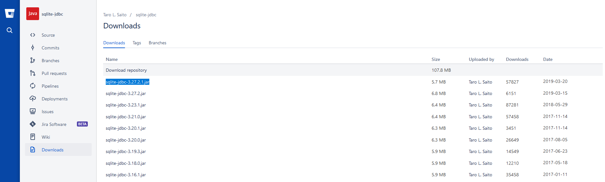
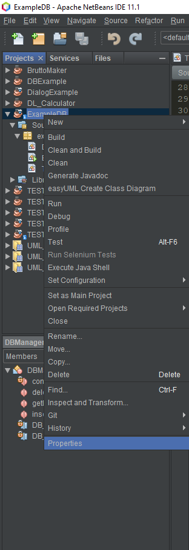
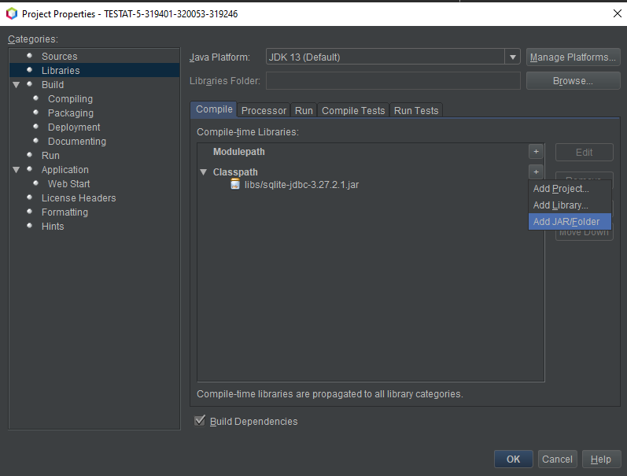

# exampleDB
Für die Programmieren Vorlesung.

Das Programm zeigt wie man eine Verbdinung zu einer SQLite Datenbank herstellt und die Einträge daraus auslesen oder löschen und neue Einträge anlegen kann.

## Anleitung für eine SQLite Datenbank in Java
* [jdbc Treiber](https://bitbucket.org/xerial/sqlite-jdbc/downloads/) herunterladen (https://bitbucket.org/xerial/sqlite-jdbc/downloads/)

  

* Die .jar Datei in euer Projekt legen (z.B in einen neuen Unterorder)

  

*  Netbeans in euren Project-Properties (Rechtsklick auf das Project -> Properties), unter "Libraries" den Treiber zum Classpath hinzufügen

  
  

* Zur Einfachheit ein [Programm zum verwalten von SQLite Datenbanken](https://sqlitebrowser.org/dl/) herunterladen (https://sqlitebrowser.org/dl/)
* Darüber eine neue SQLite Datenbank anlegen (auch in eurem Projektordner) mit Tabellen wie ihr sie eben braucht
* Dann könnt ihr die Datenbank auch schon in Java verwenden, hierzu sollte das Code-Beispiel helfen

## Alternativ:
* Dieses Projet kopieren (Rechsklick in Netbeans auf das Projekt -> Copy), alle Klassen außer dem DBManager löschen und mit euren Klassen ersetzen
* Die Datenbank mit Hilfe des oben genannten Programms anpassen und natürlich auch den DBMAnager an eure Klassen und Daten anpassen

## Datenbank Beispiel von Mustafa Rasheed
* https://lms.hs-pforzheim.de/mod/forum/discuss.php?d=19522
* https://lms.hs-pforzheim.de/mod/forum/discuss.php?d=19561

## Zusätzliche Resourcen:
* https://www.sqlitetutorial.net/sqlite-java/select/
* https://www.sqlitetutorial.net/sqlite-java/insert/
* https://www.sqlitetutorial.net/sqlite-java/delete/
* https://www.sqlitetutorial.net/sqlite-java/update/
